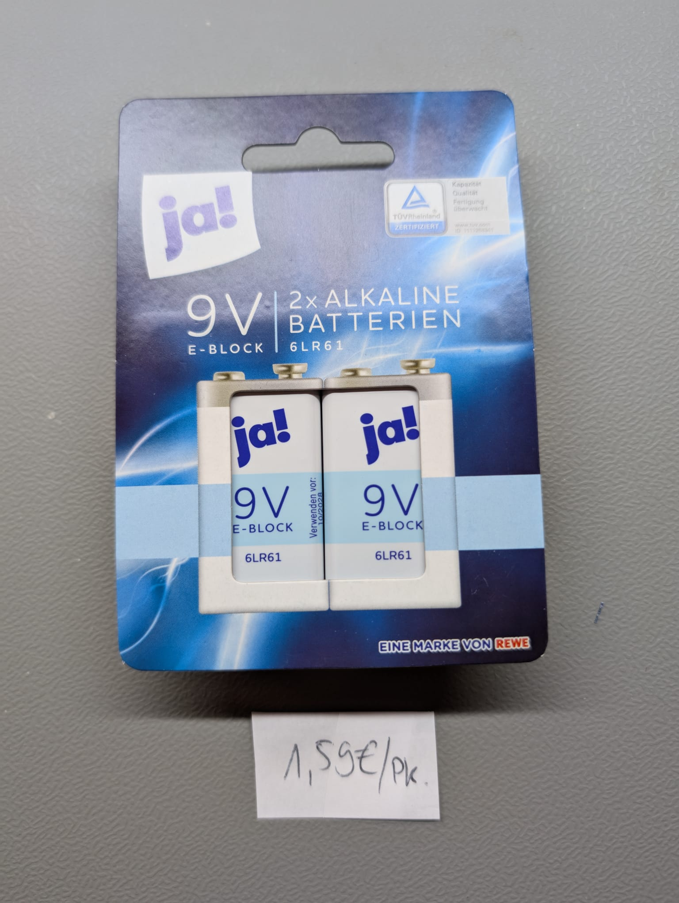

# T001 - Battery Endurance Test with Constant Load

For the edurance test we will apply a constant load to the battery.
To achieve a good comparison we will define basic rules and constants to each battery type.
These you can find under 'Battery Profiles' in this readme.
You can however set specified values for each model based on the datasheets. For my Meaurements I will 
provide a table overview of my used values for each battery type and most of the time they will be
very similar or identical per type for a better comparison. These are general purpose values.
If you add all the battery parameter to the [T001 - Script](../../../DeviceTools/SDL1020X-E/T001_BatteryEnduranceTest.py)
it will automatically define a unique CSV file name for your testrun with the following pattern 
'T001_testDate_Brandname_ModelNumber_imprintDate.csv'

## Current State - In Progress
There are a few things I really want to change before further updating any results.

## Battery Profiles 
If you adjust the "assumed dead Voltage" below the given Value for the battery type please keep
the constPower value identical for comparison reasons.

| Battery Type  | nominal_U [V] | nominal_I [mA] | dead_U [V] | constPower [W]  |
|---------------|---------------|----------------|------------|-----------------|
| 9V Block      | 9.00          | 0.100          | 6.00       | 0.60            |

## Testruns and Results
### ALDI - Topcraft Ultra Alkaline

You can find the [CSV Measurements](Measurement_archive/T001_30-03-2025_Topcraft_6LR61_01-2023.csv)
Battery Test Result Summary: 30.03.2025

| Parameter                 | Value                       |
|---------------------------|-----------------------------|
| Testduration              | 14798.0 s (246.63 min)      |
| Sample count              | 14798                       |
| Avarage voltage           | 7.106 V                     |
| Avarage current           | 85.13 mA                    |
| Avarage power             | 600.99 mW                   |
| Capacity (Q)              | 349.92 mAh                  |
| Energy (E)                | 2.470 Wh                    |
| Voltage Drop              | 9.105 V → 6.000 V = 3.105 V |
| Avarage resistance        | 84.58 Ohm                   |
| Price per DUT [EUR]       | N/A                         |
| Imprinted Date            | 01-2023                     |

Important Note: This was a Battery laying around for a first Test. From now only new Batterys
out of the Box with complete Documentation of parameters

### REWE - JA 6LR61_10E0A03

| Parameter                 | Value                       |
|---------------------------|-----------------------------|
| Testduration              | 17479.0 s (291.32 min)      |
| Sample count              | 17479                       |
| Avarage voltage           | 7.435 V                     |
| Avarage current           | 81.60 mA                    |
| Avarage power             | 601.41 mW                   |
| Capacity (Q)              | 396.19 mAh                  |
| Energy (E)                | 2.920 Wh                    |
| Voltage Drop              | 8.816 V → 6.000 V = 2.816 V |
| Avarage resistance        | 92.71 Ohm                   |
| Price per DUT [EUR]       | 0,80                        |
| Imprinted Date            | 10-2028                     |

