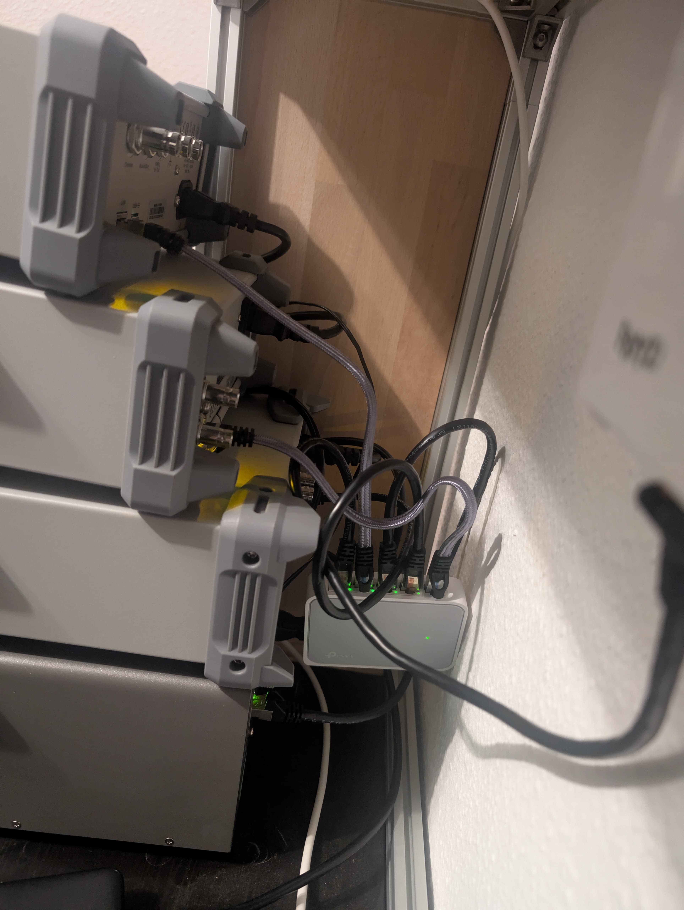

# Device Tooling Overview

## Roadmap
| Timeslot | Doing                                   |
|----------|-----------------------------------------|
| Q2/2025  | Started working on Siglent SCPI over IP |

## SPD4323X
- See under [UserManuel_EN01B.pdf](../src/docs/SPD4000X_UserManual_EN01B.pdf#page=59) ([online link](https://www.siglenteu.com/wp-content/uploads/dlm_uploads/2024/08/SPD4000X_UserManual_EN01B.pdf#page=59))
- 

## Setup
- USB HUB for all devices
- [Fritz!Repeater 1200 AX](https://www.amazon.de/dp/B09N4SJLWM?ref=ppx_yo2ov_dt_b_fed_asin_title) connects with a Network Switch to all devices
- 
- Install the Keysight Connetion Suite IO
- Add your Devices and if you like add ALIAS Names for them
- 
