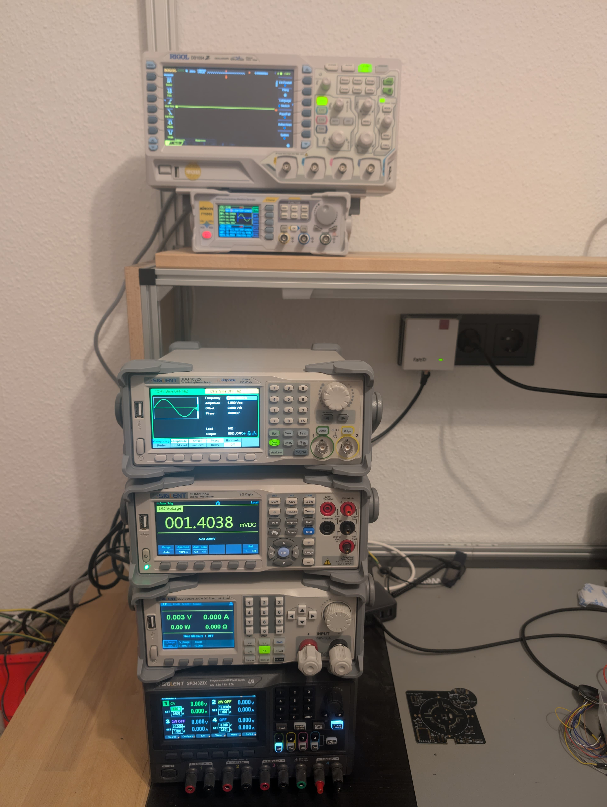

# HomeLabTools
A Collection of Tools for the homeLab applications ranging from device controls to data analytics

## State
Just Started and in Progress whenever I have time

## HomeLab Devices
All Devices that are included or planned to be supported (❌ Not Supported yet | ✅ Supported | 🧪 Testing)
| Company   | Model     | Description           | Supported State        | Interface |
|-----------|-----------|-----------------------|------------------------|-----------|
| Rigol     | DS1054    | Oszilloscope          | ❌ Not Supported yet   | LAN/USB   |
| KMoon     | FY6900    | Function Generator    | ❌ Not Supported yet   | USB       |   
| Siglent   | SDG1032X  | Function Generator    | ❌ Not Supported yet   | LAN/USB   |
| Siglent   | SDM3065X  | Multimeter DMM        | ❌ Not Supported yet   | LAN/USB   |
| Siglent   | SDL1020X-E| 200W Electronic Load  | ❌ Not Supported yet   | LAN/USB   |
| Siglent   | SPD4323X  | DC Power Supply       | 🧪  Testing            | LAN/USB   |
| Stamos    | S-LS-29   | DC Power Supply       | ❌ Not Supported yet   | USB       |

## Setup
All devices in this setup should work together over dedicated scripts 

## By me a beer via PayPal
If you like my work and would consider a small donation to support my work I would be very grateful.
https://www.paypal.me/tiro1999